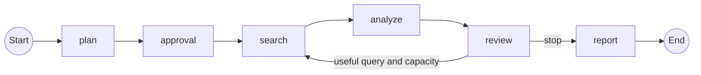

# Implementation walkthrough

This document traces the application that exists in this repository. Read [the foundations](llm-agent-engineering-foundations.md) for the concepts, and use the [README](../README.md) for installation and commands. The [saved offline report](../examples/offline/report.md) and its [structured artifacts](../examples/offline/artifacts.json) are the running example: three explicitly synthetic abstracts, two search rounds, ten deterministic model substitutes, and one checked comparison.

The primary entry point is `run_research()` in [workflow.py](../src/research_agent/workflow.py). The CLI and MCP server call this same function. A run validates its request, saves it, executes a LangGraph workflow, and retains the evidence needed to inspect or export the resulting report. The small manual loop remains a separate teaching example.

## Read the code by responsibility

| File | Main responsibility | Useful starting point |
|---|---|---|
| [models/workflow.py](../src/research_agent/models/workflow.py) | Provider-independent Pydantic contracts for requests, sources, evidence, and review | `ResearchRequest`, `Limits`, `Source`, `Evidence` |
| [config.py](../src/research_agent/config.py) | Read model and provider settings from the environment | `Settings.from_environment()` |
| [discovery.py](../src/research_agent/discovery.py) | Retrieve arXiv/OpenAlex records, normalize identifiers, deduplicate, and optionally read accessible arXiv HTML | `search_papers()`, `deduplicate_sources()`, `read_source()` |
| [model.py](../src/research_agent/model.py) | One bounded structured model call, with a deterministic offline substitute | `structured_call()`, `offline_output()` |
| [storage.py](../src/research_agent/storage.py) | Local SQLite artifacts, counters, controls, events, and HTTP cache | `Store` |
| [workflow.py](../src/research_agent/workflow.py) | Stage order, source selection, evidence checks, review routing, and report formatting | `build_graph()`, `rank_sources()`, `save_report()` |
| [cli.py](../src/research_agent/cli.py) | Translate terminal arguments into those application operations | `main()` |
| [mcp_server.py](../src/research_agent/mcp_server.py) | Expose the same operations as local MCP tools | `create_server()` |

There is no class for a planner, analyst, or reviewer. They are functions inside `build_graph()`, sharing the saved request and store. `Store` is a class because database operations share a path and a persistence contract. Pydantic classes declare data, not autonomous behavior. This keeps the number of abstractions close to the actual implementation needs.

## The graph and its state



`StateGraph(GraphState)` registers these nodes and edges. The review node returns `repeat`; `add_conditional_edges()` reads that Boolean to route to `search` or `report`. Python computes it from the review and remaining round/paper capacity. The model does not choose arbitrary nodes or execute tools itself. LangGraph describes this distinction between a predefined workflow and a more dynamic agent in its [workflow documentation](https://docs.langchain.com/oss/python/langgraph/workflows-agents).

`GraphState` contains only `run_id`, `round`, `queries`, and `repeat`. A node returns the fields it changes; LangGraph merges them into state. Larger domain records live in `Store` under artifact keys. For example, a checkpoint's `run_id` lets `analyze()` load the plan and selected sources without copying every abstract into every graph checkpoint.

`run_research()` compiles the graph with `SqliteSaver` and sets `configurable.thread_id` to the run ID. This binds graph recovery to the same saved run. Graph checkpoints and application artifacts share the database file but serve different purposes: checkpoints identify where execution resumes; artifacts retain what the research actually produced. See LangGraph's [persistence documentation](https://docs.langchain.com/oss/python/langgraph/persistence).

## Trace the offline example

The example asks how quantization and pruning affect vision-transformer inference on edge GPUs. It is teaching data, not a literature review. `offline_sources()` supplies a fixed corpus and `offline_output()` replaces remote model responses. The ordinary graph, storage, evidence validation, review routing, and report code still execute.

| Boundary | What the code does | New substitute calls |
|---|---|---:|
| `run_research()` | Validate and save the request; allocate a `research-…` ID; acquire the run | 0 |
| `plan` | Save an objective, two subquestions, and the initial query | 1 |
| `approval` | Continue immediately unless `pause_after_plan` was requested | 0 |
| `search`, round 1 | Retrieve synthetic quantization/pruning abstracts, deduplicate, rank, and select them | 0 |
| `analyze`, round 1 | Extract one exact paragraph from each source and check each proposed claim | 4 |
| `review`, round 1 | Mark the missing comparable-performance information and propose a setup query | 1 |
| `search`, round 2 | Add the synthetic Desktop-B mixed-precision abstract | 0 |
| `analyze`, round 2 | Extract its paragraph and check its claim; skip the two already analyzed sources | 2 |
| `review`, round 2 | Review all accepted evidence; separately check one `different_setup` comparison | 2 |
| `report` | Format the checked findings, comparison, gaps, limits, and references | 0 |
| **Total** | **Two rounds, three analyzed sources, three supported excerpts** | **10** |

The planner's subquestions are “Which approaches does the supplied corpus describe?” and “Are the reported setups comparable, and what remains unknown?” These are intentionally general classroom questions; the offline substitute is not a realistic planner for every possible input. Live mode uses the configured model to produce a question-specific plan, with short topic queries rather than words such as “abstract” that merely describe the reading task.

An optional `ResearchRequest.search_queries` list, supplied by repeatable CLI `--query` arguments, replaces the planner's initial queries while keeping its objective and subquestions. This gives you a small practical steering point when a named method such as `FQ-ViT` is a better retrieval term than a broad generated query. Queries are validated, saved in the plan, and capped by `max_queries`; review may still propose later gap-directed queries.

`search()` stores provider results before combining them with previously retained sources. `deduplicate_sources()` joins exact identifiers, or a conservative exact normalized title/first-author match without conflicting DOI/arXiv identities. `rank_sources()` assigns 80% to question-word overlap, 10% to recency, and 10% to abstract availability. A source with no question-word overlap is excluded. Every score records its component reasons; citation counts are available metadata, not part of the ranking.

The ranking is deliberately understandable and imperfect. It can miss synonyms and favor recent abstracts over an older relevant paper. The free-text scope guides planning and support assessment; it is not a hard database filter for publication year, dataset, or hardware. Inspect selection reasons before interpreting a small result set as representative coverage.

In round one, each accepted claim is identical to its synthetic abstract. One says that INT8 reduced batch-one latency on fictional Edge-A; the other says sparse pruning alone did not help the dense kernel used there. The follow-up abstract reports FP16 throughput on fictional Desktop-B at batch size thirty-two. The comparison identifies different hardware, batch size, and metrics. It does not call the results contradictory or invent numerical improvements.

The final outcome is `partial`. The conservative substitute leaves comparable quantitative performance and deployment applicability unresolved, even though it can identify one difference in setup. This demonstrates that producing a valid report and completing the requested research scope are separate conditions. Offline runs never receive `completed` status.

## From source text to a report claim

`Source` preserves an internal `source_id`, provider identifiers, URL, metadata, retrieval records, and retained content. Each retrieval records provider, query, URL, retrieval time, and cache use. Discovery may provide metadata only, an abstract, or accessible HTML full text; that reading level is explicit.

`analyze()` reads at most the first 16,000 characters of retained content. Metadata-only records receive an analysis note and no evidence. Optional arXiv HTML retrieval retains at most 120,000 characters and records extraction/truncation limitations; reading that HTML does not imply that the model saw the complete paper, equations, tables, or figures. The analysis artifact records its actual window and whether it was truncated.

There are three different checks, in this order:

1. **Contract validation:** `structured_call()` requests an `Analysis` with Pydantic fields. Live mode uses the OpenAI SDK's typed parsing API by default. The explicit JSON-mode fallback still validates the returned JSON locally. Schema validity establishes shape, not truth; see [Structured Outputs](https://developers.openai.com/api/docs/guides/structured-outputs).
2. **Identity and linkage:** Python verifies source identity consistency, an in-range subquestion index, and an exact contiguous quotation inside the reading window. `citation_identity()` checks retained identifiers/provenance; it does not independently verify a publisher's record or an experimental result.
3. **Claim support:** a separate `SupportDecision` assesses whether the quotation and nearby context support the whole claim within the question and scope. A valid identifier and matching words are insufficient. A linked quotation can still receive `supported=False`.

Ancillary analysis fields are also constrained: `problem`, `method`, and limitations survive only as verbatim excerpts; dataset/metric terms must appear literally in the supplied window. Raw responses remain under `model/...` for inspection and reuse. Those are tentative model drafts, including rejected content. Their presence is not a support endorsement.

Accepted `Evidence` stores the claim, exact quote, source ID, reading level, subquestion, support decision, and `start`/`end` offsets. Offsets are Python character indices into retained `Source.content`, with an exclusive end. In the saved example, quantization evidence `ev-428c796bb847` points to `synthetic:quantization`, characters `0:423`. You can understand the linkage with ordinary Python:

```python
source_text = source["content"]
retained_quote = source_text[evidence["start"]:evidence["end"]]
print(retained_quote)  # The same text stored in evidence["quote"].
```

The reviewer receives supported evidence and source titles/reading levels, rather than unchecked analysis drafts. Proposed comparisons must cite known accepted evidence from at least two distinct sources. Another `SupportDecision` checks both the explanation and relation. `comparison_checks/<round>` retains accepted and rejected proposals; only accepted comparisons survive in the saved review.

Coverage is constrained to subquestions with accepted evidence. A model must also judge the evidence sufficient before live mode can finish as `completed`; provider errors keep the outcome `partial`. These judgments can still be wrong. Read the exact excerpts and distinguish author-reported evidence from the reviewer's synthesis. The [foundations' evidence discussion](llm-agent-engineering-foundations.md#sources-evidence-claims-and-citations) explains why textual support is narrower than independent scientific validation.

`save_report()` is deterministic. It uses supported evidence and checked comparisons, with explicitly labeled gaps, limitations, and reading depth. There is no final writer call that can add new scientific findings. The structured export also includes rejected checks and raw model outputs, so the report and audit trail have different inclusion rules.

## Inspect the artifact trail

`Store.inspect()` returns three objects: the run record, an artifact dictionary, and ordered events. `Store.export()` writes that inspection as `artifacts.json` and the available report as `report.md`. The example export contains these useful keys:

| Artifact key | What it establishes |
|---|---|
| `plan` | The objective, subquestions, initial queries, and scope notes |
| `search/<hash>` | One saved query/provider/round result, including retrieval errors |
| `search_round/1`, `search_round/2` | Queries, raw/unique counts, provider results, and newly selected IDs |
| `sources`, `selected` | Current retained source records and selected identities |
| `analyses` | Per-source reading depth and filtered structured extraction |
| `evidence`, `citation_checks` | Linked evidence plus identity, linkage, and semantic-support decisions |
| `review/1`, `review/2`, `review` | Historical reviews and the latest checked review |
| `comparison_checks/2` | Why a proposed cross-source relationship was accepted or rejected |
| `model/<operation>` | Cached tentative structured model/substitute responses |
| `stage/<stage>` | Completed node results used to avoid repeating saved work |
| `outcome`, `report` | Stopping decision, formatted report, and included evidence IDs |

Stage events record starts, completions, durations, model/substitute calls, retries, provider errors, and controls. They make the run understandable without reproducing every prompt in a conversation history. A replay may add another start event for an unfinished stage; events are an operational timeline, not a guarantee of one event per logical operation.

## Persistence, replay, and recovery

`Store` uses SQLite tables for runs, keyed JSON artifacts, events, and expiring HTTP cache entries. `SqliteSaver` adds its own checkpoint tables. Write-ahead logging allows the HTTP worker threads to record progress through separate connections. `BEGIN IMMEDIATE` serializes counter reservations and run updates so two workers cannot admit work against the same remaining budget independently.

A checkpoint can only resume from what was durably saved. LangGraph may re-enter an unfinished node. The stage wrapper first checks `stage/<key>` and returns its saved state delta when available. Inside an unfinished stage, `search/<hash>`, `model/<operation>`, and the source's completed analysis prevent ordinary duplication. Evidence and its check are saved together with `put_many()`; replay recognizes the stable evidence ID before appending it again.

Artifacts and graph checkpoints are separate transactions. A crash between them can cause node replay, which the artifact keys are designed to tolerate. Source text is frozen after analysis, even when later discovery adds identifiers or better content. Historical analyzed records remain available when a later identity bridge merges records; previously saved evidence offsets must still resolve to their original text.

This provides reuse of recorded work, not exactly-once remote execution. If a provider/model returns and the process dies before saving that response, recovery may repeat the request. Its previous reservation remains charged. No local SQLite transaction can atomically commit a response on an unrelated remote service. This is an important boundary when interpreting retries, usage, and checkpoint guarantees.

The database records a process owner while a run is active. A second process cannot start the same run while that owner is alive. If the owner has died, a later invocation can reclaim it. Because an unclean stop has no trustworthy end timestamp, the elapsed-time counter conservatively charges the interval until recovery. Long crash downtime can therefore exhaust the saved run's time budget; normal paused time is excluded.

| Outcome/control | Application behavior |
|---|---|
| `completed` | Live review judged all planned subquestions covered, without recorded provider errors; report available |
| `partial` | A useful report exists, but evidence/scope, provider availability, or the offline demonstration leaves limitations |
| `paused` | Saved work can continue; an approval interrupt requires explicit approval |
| `halted` | Cancellation or a resource bound ended the run; retained work can be exported, but this run is terminal |
| `failed` | An unexpected error stopped execution; repair configuration/external conditions and resume the saved work |

With `pause_after_plan`, the `approval` node calls `interrupt()` before retrieval. Its payload tells the caller to inspect the saved plan. A plain resume leaves this interrupt paused. Explicit approval supplies `Command(resume="approve")` with the same thread ID. LangGraph restarts an interrupted node from its beginning, so this node has no non-idempotent action before `interrupt()`; see the [interrupt guide](https://docs.langchain.com/oss/python/langgraph/interrupts).

Pause and cancel commands set a database control flag. `Store.guard()` observes it at meaningful execution/request boundaries. An already running network request may finish first; these controls do not forcibly terminate a remote call. Ctrl-C records a pause and retains saved work. Repeating resume on a finished run returns its record and does not rerun research. Terminal recovery also creates a missing report artifact if a crash occurred before it was saved.

## Bounds, retries, and caching

`ResearchRequest.limits` is saved with the run. Pydantic rejects invalid values; the workflow enforces rounds, queries per round, results per query, analyzed papers, model calls, elapsed time, HTTP requests, downloaded bytes, and concurrency. Model retry attempts count as calls. Analysis is sequential; discovery uses a bounded `ThreadPoolExecutor`. arXiv additionally serializes requests within this process with at least three seconds between request starts, following its [API terms](https://info.arxiv.org/help/api/tou.html). Separate application processes do not share that limiter.

The `max_tokens` control is deliberately conservative. Before each live attempt, `reserve_model()` atomically admits this quantity:

```text
UTF-8 bytes of instructions + input JSON + output schema
    + configured maximum output tokens + 1,024 protocol allowance
```

`usage.reserved_tokens` accumulates these reservations without refunds. It is not a tokenizer count. `usage.tokens` records actual total tokens reported by successful model responses when available. Offline substitutes increment `model_calls` but use zero tokens. The application does not estimate monetary cost or pretend that unknown usage is measured. A small reservation limit can stop a run even when observed tokens are much lower; inspect both counters.

HTTP request count is reserved before a request. Downloaded bytes are charged after chunks arrive, including bytes that cross the limit. Consequently the stored counter reflects actual reception and can exceed its threshold by at most one already-read chunk, up to 65,536 bytes, per active worker. Request timeouts and remaining-time checks bound retrieval; blocking work already in progress may finish after the exact deadline before the next guard records the halt.

Model calls disable SDK retries and allow one application retry for connection failures or selected transient HTTP statuses. Discovery allows at most two retries for those temporary failures, respects bounded `Retry-After`, and uses explicit body/time limits. Invalid schemas, permanent HTTP errors, and refused model outputs are not blindly retried. General workflow error records retain exception type/status rather than potentially sensitive API response bodies.

Successful raw HTTP responses are cached for one day in SQLite, reducing repeated discovery/content retrieval. Each `Retrieval` marks cache use, and cached retrieval retains the original response timestamp. Saved per-run model outputs are reused by operation key. The cache does not turn a retrieved source into trusted instructions or establish its claims; the [foundations' trust-boundary discussion](llm-agent-engineering-foundations.md#prompt-injection-and-practical-trust-boundaries) applies throughout.

## The MCP connection

MCP changes how an application capability is reached, not the research logic. The local server exposes eight tools: `run_research`, `inspect_research`, `resume_research`, `pause_research`, `cancel_research`, `export_research`, `search_literature`, and `read_source`. The first six use the same workflow/store operations as the CLI; discovery tools call the same source functions. Direct discovery operations have adapter timeout/body/result bounds but do not consume a research run's counters.

```text
Host application / user policy
          │ owns the client and authorizes tool use
          ▼
ClientSession ── stdio JSON-RPC ── FastMCP server
                                      │
                                      ▼
                      workflow / discovery / SQLite Store
```

The host manages the user interaction and permission policy. Its client maintains one protocol session with this server. The server declares capabilities, validates tool arguments, and performs local operations. A discovered tool schema describes arguments; it does not grant permission to spend resources, export files, or publish material. This project uses local stdio, without a network deployment or an authentication service. See the official [MCP architecture](https://modelcontextprotocol.io/docs/learn/architecture).

The dependency range deliberately keeps the Python SDK on v1 (`mcp<2`); the lockfile supplies the concrete version. `FastMCP`, `ClientSession`, `StdioServerParameters`, and `stdio_client` therefore follow the [v1 SDK documentation](https://py.sdk.modelcontextprotocol.io/v1/) rather than newer v2 examples.

[experiments/mcp_client/main.py](../experiments/mcp_client/main.py) demonstrates a real client connection: launch the server with the same Python interpreter, enter the stdio/session context managers, call `initialize()`, then `list_tools()`. It prints names/descriptions and `run_research.inputSchema`, invokes offline research with `call_tool()`, checks `isError` and `structuredContent`, and invokes `inspect_research` for the returned run ID. This proves discovery and invocation rather than just server startup. The official [v1 stdio client example](https://github.com/modelcontextprotocol/python-sdk/blob/v1.x/examples/snippets/clients/stdio_client.py) shows the same session lifecycle.

The demonstration launches an offline server without passing model credentials. A host that enables live operations must deliberately configure the server environment and authorize those operations. Retrieved papers cannot grant that authority, and the research model has no shell, arbitrary URL fetcher, or tool for publication.

## Explore one run yourself

Start with the saved offline report, then open its artifacts. Follow one evidence ID to the source and its offsets; find the matching `citation_checks` entry; inspect `comparison_checks/2`; then compare `review/1` with `review/2` and the conditional routing in `build_graph()`. Finally, inspect `stage/` and `model/` keys to see which results a resumed node can reuse.

Use the README's approval, resource-limit, direct-provider, and MCP commands to observe the other boundaries. [Verification notes](verification.md) distinguish ordinary application runs that were actually inspected from implementation behavior inferred from code. The [framework comparison](llm-agent-engineering-foundations.md#choosing-the-framework-for-this-repository) explains why the manual loop, Agents SDK, and PydanticAI remain learning references while LangGraph is the production workflow.
